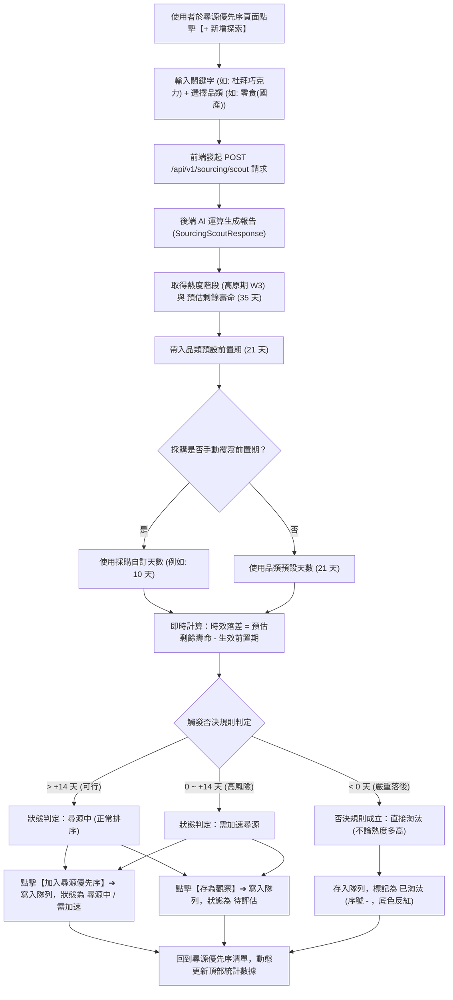

# S-17 尋源探索與優先序決策系統 (Sourcing Queue) 業務流程與 API 設計文檔

本文件梳理「尋源優先序（Sourcing Queue）」與「尋源探索評估（Sourcing Scout）」的業務流程、API 規範、資料實體設計與否決規則。

---

## 一、 業務流轉架構與流程圖 (Mermaid)



---

## 二、 API 對接清單

### 1. 現有已生成的後端 API (Spring Boot / OpenAPI)

| API 服務 | 端點 (Endpoint) | HTTP Method | 說明 |
| :--- | :--- | :---: | :--- |
| `SourcingScoutControllerService.scout` | `/api/v1/sourcing/scout` | `POST` | 發起關鍵字尋源探索分析（傳入 keyword、categoryId） |
| `SourcingScoutControllerService.latest1` | `/api/v1/sourcing/candidates/{productId}/report` | `GET` | 依據商品 ID 查詢最近一次的尋源探索報告 |
| `AiTaskControllerService.get` | `/api/v1/ai/tasks/{taskId}` | `GET` | 查詢非同步 AI 任務執行狀態與進度 |
| `AiTaskControllerService.items` | `/api/v1/ai/tasks/{taskId}/items` | `GET` | 查詢 AI 任務產出的品項明細 |
| `AiBudgetControllerService.current` | `/api/v1/ai/budgets` | `GET` | 查詢當日 AI 調用預算與配額剩餘情況 |

### 2. 待補齊之隊列管理 API (Sourcing Queue CRUD)
> *備註：在後端提供以下端點前，前端以 `SourcingQueueService` 結合 LocalStorage 進行狀態管理與持久化。*

- `GET /api/v1/sourcing/queue`：取得尋源優先序清單（支援狀態篩選與分頁）。
- `POST /api/v1/sourcing/queue`：將評估完成的候選商品存入隊列。
- `PATCH /api/v1/sourcing/queue/{id}/status`：更新品項狀態（`EVALUATING` | `SOURCING` | `EXPEDITE` | `CONVERTED` | `ELIMINATED`）。
- `PATCH /api/v1/sourcing/queue/{id}/lead-time`：採購修改前置期天數並重新計算時效落差。

---

## 三、 品類配置 (Category Config) 與演算法

### 1. 品類預設前置天數字典
```typescript
export interface CategoryOption {
  id: number;
  name: string;
  defaultLeadTimeDays: number;
}

export const PRESET_CATEGORIES: CategoryOption[] = [
  { id: 1, name: '零食 (國產)', defaultLeadTimeDays: 21 },
  { id: 2, name: '進口食品 / 特產', defaultLeadTimeDays: 45 },
  { id: 3, name: '常溫飲料 / 沖泡', defaultLeadTimeDays: 30 },
  { id: 4, name: '調味醬料 / 抹醬', defaultLeadTimeDays: 35 },
  { id: 5, name: '生鮮 / 短效期冷藏', defaultLeadTimeDays: 14 }
];
```

### 2. 否決規則演算法 (Gatekeeper Rules)
$$\text{時效落差 (Time Gap)} = \text{預估剩餘壽命} - \text{生效前置期}$$

- **`> +14 天`（可行）**：排序正常，加入優先序時狀態標記為 `尋源中`。
- **`0 ~ +14 天`（高風險）**：時效緊迫，加入優先序時狀態標記為 `需加速`。
- **`< 0 天`（淘汰條件）**：時效落差為**否決條件**而非加權因子，不論熱度多高均直接判定 `已淘汰`。

---

## 四、 資料結構定義 (Data Model)

```typescript
export interface SourcingQueueItem {
  id: string | number;               // 唯一編號
  rank?: number;                     // 顯示序號 (01, 02, 03... 已淘汰為 '-')
  keyword: string;                   // 搜尋關鍵字 (例如: 杜拜巧克力(代工))
  productId?: number;                // 商品 ID
  categoryId: number;                // 品類 ID
  categoryName: string;              // 品類名稱 (例如: 零食(國產))
  
  // AI 評估生命週期
  heatStage: 'RISING' | 'PLATEAU' | 'DECLINING'; // 熱度階段 (上升期 / 高原期 / 衰退期)
  stageWeeks?: number;               // 週數 (例如: 高原期 W3)
  estimatedLifespanDays: number;     // 預估剩餘壽命天數 (例如: 35)
  
  // 前置期與落差
  defaultLeadTimeDays: number;       // 品類預設前置期 (例如: 21)
  overrideLeadTimeDays?: number;     // 採購覆寫前置期 (若有)
  effectiveLeadTimeDays: number;     // 最終生效前置期
  timeGapDays: number;               // 時效落差天數 (例如: +14)
  
  // 狀態與決策
  status: 'EVALUATING' | 'SOURCING' | 'EXPEDITE' | 'CONVERTED' | 'ELIMINATED';
  // 對應中文：待評估 | 尋源中 | 需加速 | 已成案 | 已淘汰
  
  riskLevel: 'FEASIBLE' | 'HIGH_RISK' | 'ELIMINATED';
  notes?: string;                    // 備註說明
  createdAt: string;                 // 建立日期
  updatedAt: string;                 // 更新日期
}
```

---

## 五、 清單頂部統計數據計算公式

- **進行中** = `尋源中 (SOURCING)` + `需加速 (EXPEDITE)` + `待評估 (EVALUATING)`
- **已淘汰** = `已淘汰 (ELIMINATED)`
- **已成案** = `已成案 (CONVERTED)`
